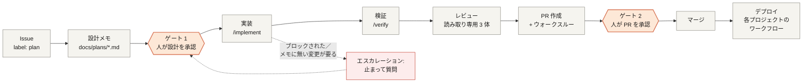
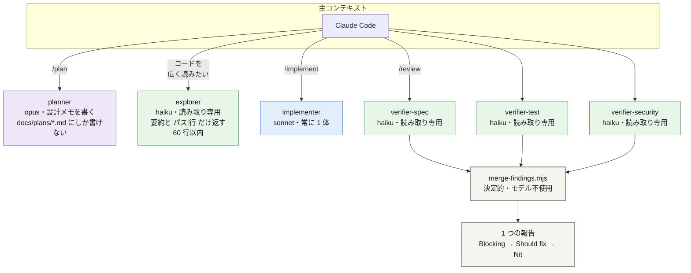
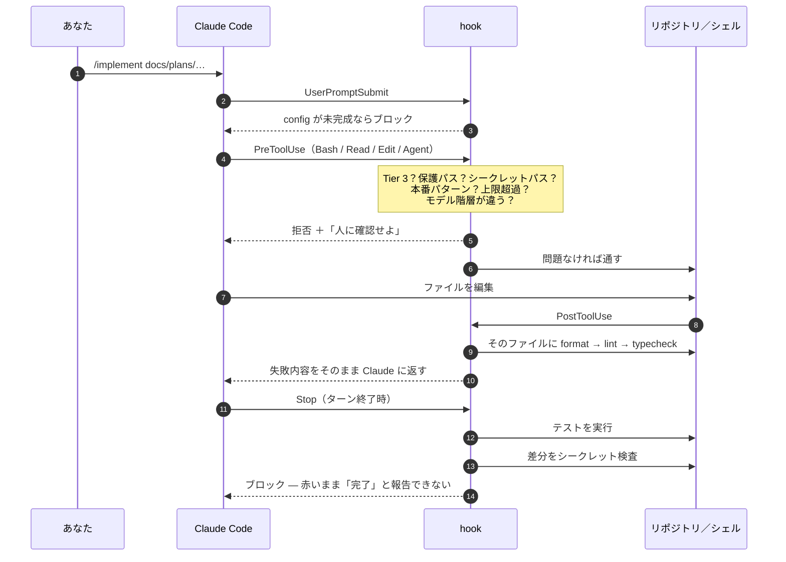
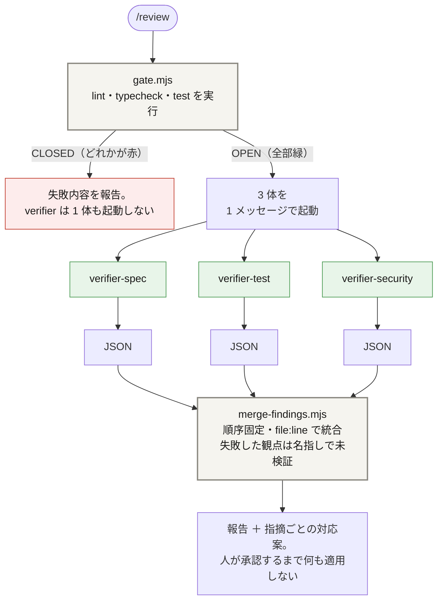
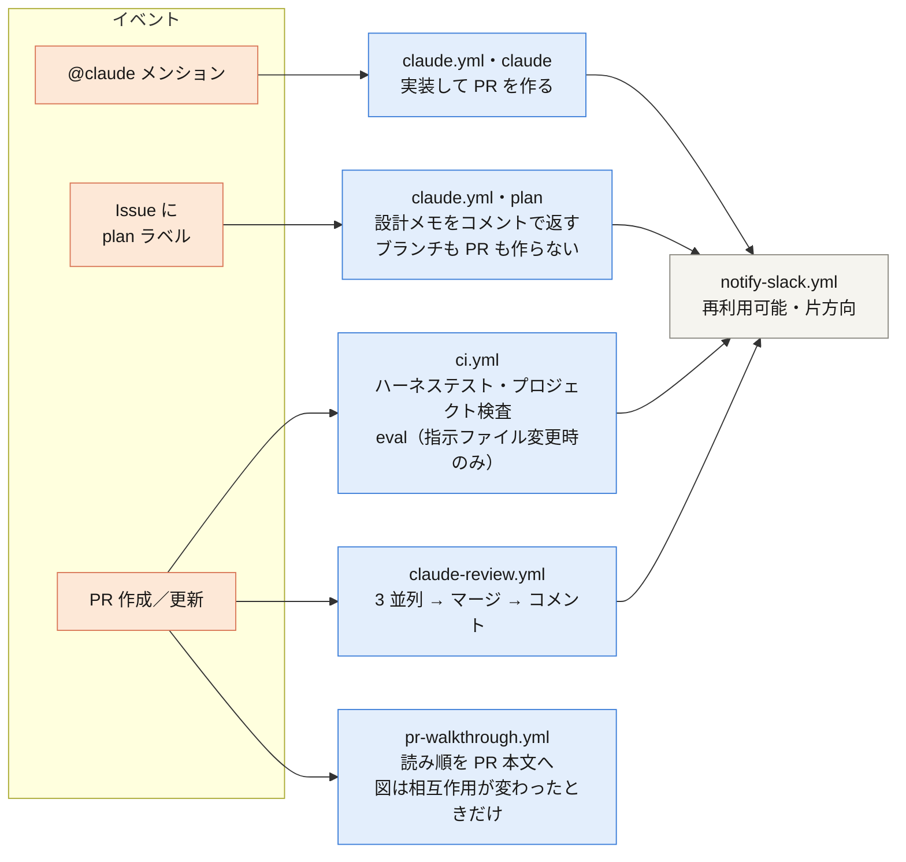
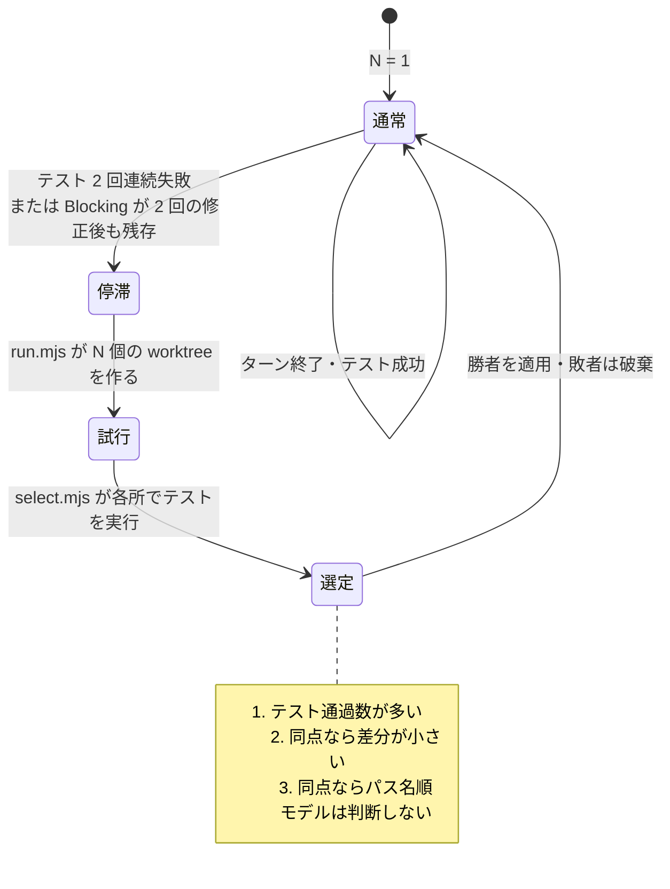
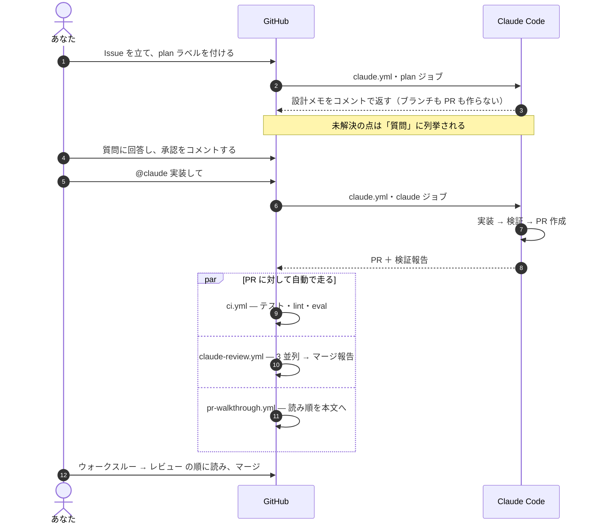

# このリポジトリの仕組みと使い方

*English: [GUIDE.md](GUIDE.md)*

これは **テンプレートリポジトリ** です。ここから作ったリポジトリには、2 ブランチ運用、Issue / PR
テンプレート、そして **エージェント運用ハーネス** が最初から入っています。ハーネスとは、Claude Code に
実作業をさせつつ、人が張り付いて見ていなくても済むようにするための、ルール・スクリプト・GitHub Actions
の組み合わせです。

この文書は「何があって、どう噛み合っていて、人は何をするのか」の地図です。ルールの正本は
[`POLICY.md`](POLICY.md)、エージェントが毎セッション読む指示は [`../../CLAUDE.md`](../../CLAUDE.md) に
あります。

**まずこれを読むべき人**: このテンプレート由来のリポジトリを引き継ぐ人、または新規プロジェクトで
使うか判断する人。

---

## 1. 全体像

Issue からデプロイまで作業が流れます。その途中で人が判断するのは **2 回だけ** です。設計の承認と
PR の承認。この 2 点の間は止まりません。本来なら人が目で見る必要のあるチェックを、スクリプトが
機械的に強制しているためです。



**なぜゲートが 2 つだけなのか。** ステップごとに承認を挟むと、承認が反射になります。読まずに「はい」を
押すようになり、増えるのは待ち時間だけです。そこで機械が判定できるもの（format・lint・型・テスト・
スキーマ・シークレット検査）は hook と CI が強制し、人の注意力は機械に判定できない 2 つの問いに
集中させます。**作るべきものは合っているか**、そして **実際に作れたのか**。

---

## 2. エージェント

読解と検証を、安いモデルの隔離されたコンテキストに寄せ、**結論だけ**を戻す構成です。エージェントを
たくさん持つこと自体が目的ではありません。高価なコンテキストを小さく保ち、検証を互いに独立させる
ためです。



| エージェント | 階層 | その階層である理由 | ツール |
| --- | --- | --- | --- |
| `planner` | **opus**（上位） | 設計判断が下流すべてに効く。1 タスクにつき 1〜2 回しか呼ばれない | 読み書き。ただし hook が `docs/plans/*.md` 以外への書き込みを拒否 |
| `implementer` | **sonnet**（中位） | 出力量が最も多い。最安だと設計の意図を取り違える | 読み書き |
| `explorer` | **haiku**（最安） | 読んで要約するだけ。呼び出し回数が最多で、判断の余地が小さい | 読み取り専用 |
| `verifier-spec` / `-test` / `-security` | **haiku**（最安） | 観点も出力形式も固定。3 体が並列に走るので単価が効く | 読み取り専用 |

**モデル階層の情報源は 1 か所だけです。** `.claude/harness.config.json` の `agents.*.model`。
エージェント定義ファイルには **意図的に `model:` を書いていません**。呼び出し側が
`scripts/agents/model-for.mjs` で解決した値を `Agent` の `model` パラメータで渡し、hook が
不一致を拒否します。これが「気づいたら上位モデルで回っていた」を防ぐ仕組みです。

### レビューを 3 つに分ける理由

1 体に「設計もテストもセキュリティも見て」と頼むと、どれかが薄くなります。3 体はそれぞれ
**設計メモと差分だけ**を見て（コードを書いた側の会話は見えません）、1 つの観点だけを担当します。

- **`verifier-spec`** — 差分は設計メモどおりか。スコープ外の変更は無いか。未実装は無いか
- **`verifier-test`** — テストが実装の写しになっていないか。エッジケース。「確認できなかったこと」は正直か
- **`verifier-security`** — 入力検証、シークレット、権限、依存の追加、外部テキストを指示として扱っていないか

指摘のマージは **スクリプト** が行います。順序は固定、同じファイル・行は 1 件に統合、結果を返さなかった
観点は **未検証** と明記されます。モデルにまとめさせると実行のたびに「まとめ方」が変わり、2 回の
レビューを比較できなくなるためです。

---

## 3. 機械が強制していること

hook がすべてのツール呼び出しの境界に立っています。パイプラインの中間を無人で走らせられるのは、
これがあるからです。



| タイミング | 何を見るか | 失敗したら |
| --- | --- | --- |
| プロンプト送信時 | `/plan` `/implement` `/review` は config が完成しているか | 止めて設定を要求 |
| ツール実行前 | Tier 3 コマンド、保護パス、シークレットパス、本番パターン、並列・入れ子の上限、モデル階層 | 理由と「人に確認せよ」を添えて拒否 |
| ファイル編集後 | そのファイルに `format` → `lint` → `typecheck` | 失敗内容が Claude に返り、その場で直す |
| ターン終了時 | テストスイート、差分のシークレット検査 | ターンを終わらせない |
| explorer 終了時 | 出力が 60 行以内で、ファイル本文の貼り付けが無いか | 要約し直させる |

ブロックは `.harness/blocked.jsonl` に追記されます。ワークフローが Claude ステップの後にこれを読んで
Slack に流します。**hook 自身は Slack に喋りません** — 送信経路を GitHub Actions に一本化し、
監査できる状態を保つためです。

### 権限 Tier

判断の軸は **可逆性と外部への副作用** です。

| Tier | 扱い | 例 |
| --- | --- | --- |
| **1** | 自動 | ファイル読み取り、リポジトリ内の編集、format/lint/typecheck/test、`git add/commit/branch/diff/log` |
| **2** | 自動 | 依存インストール、ビルド、ローカル起動、npm/PyPI/GitHub からの取得 |
| **要確認** | 人に聞く | `git push`、`gh pr create/merge`、`git reset --hard`、`git rebase` |
| **3** | 拒否 | force push、`rm -rf`、`sudo`、`curl`/`wget`、デプロイコマンド、`npm publish`、`.github/workflows/**` `.claude/**` `.mcp.json` の編集、`.env*` や鍵ファイルの読み取り、本番への接続 |

Tier 3 は理由と承認者の在り処を添えて拒否されます。黙って失敗することはありません。

---

## 4. `/review` の流れ



レビュアーは高価で、lint が赤いうちの指摘はノイズになります。だからゲートが先に来て、しかもそれは
ただのスクリプトです。CI でも同じ 3 体構成が 3 並列ジョブとして走るので、1 観点が落ちても
失敗ジョブとして見え、残り 2 つは報告されます。

---

## 5. GitHub Actions で走るもの



**Slack は通知専用です。** 承認も回答も GitHub 上で行い、監査ログを 1 か所に集めます。Claude Code は
Slack 送信ツールを一切持っておらず、送信はワークフローが行います。各メッセージは 10 行以内、悪い知らせを
先頭に置き、差分・ログ全文・シークレットらしき文字列を含みません。イベントは `plan.ready`、
`escalation`、`pr.opened`、`verify.report`、`blocked`、`ci.failed`、`eval.failed`、`deploy.done`。

### PR ウォークスルー

すべての PR に、本文の先頭へ読み順が書き込まれます。`<!-- harness:walkthrough:start -->` マーカーで
囲まれているので、再実行時はそこだけが差し替わり、あなたが手で書いた本文は残ります。順序は固定で、
**スキーマ → 型 → ロジック → 呼び出し元 → UI → テスト → 設定 → ドキュメント**。前提が先に来るので、
読んでいて戻る必要がありません。

シーケンス図が付くのは、差分が **相互作用を変えたとき** だけです。外部 API 呼び出し、イベント、
非同期ジョブ、認証・認可フロー。この判定はモデルではなく静的パターンが行います。図が出た場合は必ず
**「自動生成・要確認」** ラベルが付き、`verifier-spec` が図と差分の食い違いを *Should fix* として扱います。

---

## 6. Best-of-N：行き詰まったときだけ



N 回試すとコストは N 倍で、うまくいっているときの追加の試行は何も生みません。だから
**常時オンにする設定は存在しません**。テストが 2 回連続で失敗したとき、または Blocking 指摘が
2 回の修正後も残ったときにだけ、自動で武装します。負けた試行は削除され、失敗理由の 1 行要約だけが
検証報告に残ります。

---

## 7. このリポジトリの使い方

### 7.1 新規プロジェクトの初期設定

```bash
# 1. GitHub で "Use this template" からリポジトリを作る

# 2. プロジェクトごとに異なる「事実」を埋める
cp .claude/harness.config.example.json .claude/harness.config.json
$EDITOR .claude/harness.config.json   # approvers, deploy, commands — 下の表を参照

# 3. シークレットを登録する（Free プランでは Org シークレットが private に届かない）
claude setup-token                    # トークンが表示される
bash scripts/bootstrap-secrets.sh     # 入力を求め、このリポジトリに登録する

# 4. ハーネスが動くか確認する
bash tests/harness/run.sh

# 5. config をコミットし、main と development にブランチ保護を設定する
```

`.claude/harness.config.json` は、プロジェクト固有の事実が置かれる **唯一の場所** です。設定・hook・
CI・スラッシュコマンドがすべてここを読むので、同期を取る作業は発生しません。

| キー | 内容 | 必須 |
| --- | --- | --- |
| `approvers` | 設計メモと PR を承認する GitHub ハンドル | ✅ 1 件以上 |
| `deploy.target` / `productionBranch` | 本番の場所と、リリースに使うブランチ | ✅ |
| `deploy.productionPatterns` | 本番のホスト名・環境名を表す正規表現。一致するコマンドはブロックされる | — |
| `commands.{format,lint,typecheck,test}` | プロジェクト固有のコマンド。`{file}` があれば編集ファイルに置換。空なら「未設定」としてスキップし、その旨を報告 | ✅ `test` |
| `agents.*.model` | 役割ごとのモデル階層 | ✅ 4 つとも |
| `budget` | `maxTurns` 30・`maxMinutes` 30・`maxParallel` 4・`maxDepth` 1・`bestOfN` 3 | ✅ |
| `protectedPaths` | 読めるが、エージェントは書き込めない | ✅ `.mcp.json` を含むこと |
| `secretPaths` | エージェントは読むことも書くこともできない | ✅ |
| `slack` | チャンネル ID、承認者の Slack ID、イベント別 on/off。channel が空なら通知は全停止 | ✅（空でよい） |

> **注意**: テンプレートには `harness.config.json` は **入っていません**（example だけ）。作るまで
> `/plan` `/implement` `/review` は実行を拒否し、何が足りないかを伝えます。これは意図的です。
> 誰が承認するのかを知らないエージェントは、作業を始めるべきではありません。

### 7.2 日々の流れ



**ローカル** では同じ流れが `/plan` → 承認 → `/implement` → `/verify` → `/review` になります。
`/absorb` は、レビュー指摘やあなたが手で入れた修正を受け取り、それを恒久的にどこへ落とすか
（eval ケース、`CLAUDE.md` への 1 行、hook の新しい拒否ルール）を提案します。

### 7.3 エージェントが止まって質問してきたら

止まるのが正しい動作です。条件は [`CLAUDE.md`](../../CLAUDE.md) §3 にあります。指示がコードや
設計メモと矛盾する、外部への副作用が要る、設計メモに無い変更が要る、環境要因でテストが動かない、
hook にブロックされた、MCP サーバーが必要になった。

回答は **Slack ではなく GitHub** に書いてください。そのうえで `/absorb <回答>` を実行すると、
同じ質問が 3 度目に来なくなります。

### 7.4 止め方

| やりたいこと | 操作 |
| --- | --- |
| 動いているジョブを止める | Actions → 該当 run → **Cancel workflow** |
| 今後の起動を止める | Actions → `Claude Code` / `Claude Review` → **Disable workflow** |
| 予算を緊急に絞る | リポジトリ変数 `HARNESS_MAX_TURNS` / `HARNESS_MAX_MINUTES`（config より優先。`HARNESS_MAX_TURNS=1` で実質停止） |
| アクセスを完全に切る | シークレット `CLAUDE_CODE_OAUTH_TOKEN` を削除またはローテーション |
| Slack だけ黙らせる | `slack.channel` を `""` にする、または `slack.events.*` を個別に `false` |
| コストを下げる | `agents.*.model` を変更する。他にモデルを固定している箇所は無いので、この 1 か所で全経路に効く |

### 7.5 何が起きたか調べたいとき

| 知りたいこと | 見る場所 |
| --- | --- |
| エージェントは実際に何をしたか | Actions → 該当 run → Claude ステップのログ |
| hook が何をブロックしたか、なぜか | 同じログの `[harness]` で始まる行。ローカルは `claude --debug hooks` |
| レビュアーの指摘 | PR のコメント「Independent review」 |
| eval の judge がなぜ PASS / FAIL としたか | CI の artifact `eval-results` → `judge-log.jsonl`（理由つき） |
| どの設計メモに基づく変更か | `docs/plans/*.md`。PR 先頭のウォークスルーからリンクされる |

---

## 8. 自分のプロジェクトに合わせる

**顧客プロジェクトでも自社プロジェクトでも品質基準は変えません。** 変わるのは
`harness.config.json` の事実だけです。プロファイル・モード・顧客／社内の分岐はどこにも存在せず、
誰かが追加すると CI が落ちます。

正当に変えたくなるもの:

- **`commands.*`** — あなたのスタックの実コマンド。テンプレートの既定は Python（`ruff` / `pytest`）
- **`deploy.productionPatterns`** — あなたにとって本番を意味するホスト名・環境名
- **`protectedPaths` / `secretPaths`** — 他に書かせたくないもの、読ませたくないもの
- **`evals/cases/`** — 「この入力にはこう振る舞ってほしい」と言語化できたら、そのつどケースを足す
- **デプロイ** — テンプレートには入っていません。自分のワークフローを追加し、Slack 通知が欲しければ
  末尾で再利用ワークフローを呼びます:

  ```yaml
  notify:
    needs: deploy
    permissions: { contents: read, issues: write }
    uses: ./.github/workflows/notify-slack.yml
    secrets: inherit
    with:
      event: deploy.done
      payload: '{"repo":"${{ github.repository }}","target":"…","deployUrl":"https://…"}'
  ```

[`POLICY.md`](POLICY.md) §10 を読まずに変えるべきでないもの: Tier 表、2 つのゲートの位置、そして
**マージ・順位付け・グルーピング・図の生成条件をスクリプトが決める**（モデルが決めない）という原則。
この 3 つが、実行のたびに出力を比較できる状態を支えています。

---

## 9. 関連文書

| 文書 | 内容 |
| --- | --- |
| [`POLICY.md`](POLICY.md) | 運用ルール本体: Tier、ゲート、エスカレーション、サンプリングレビュー、kill switch、監査ログ、OpenTelemetry |
| [`../../CLAUDE.md`](../../CLAUDE.md) | エージェントが毎セッション読む指示: 進め方、エスカレーション条件、報告フォーマット、禁止事項 |
| [`MCP_CATALOG.md`](MCP_CATALOG.md) | 承認済み MCP サーバーと、新規追加に必要なセキュリティレビュー |
| [`EXTERNAL_REVIEW.md`](EXTERNAL_REVIEW.md) | 任意の外部レビューツールと、自前 verifier との役割分担 |
| [`../../README.md`](../../README.md) | ブランチ運用と GitHub Actions の Claude Code |
| `tests/harness/run.sh` | 上記すべてを実行可能なテストにしたもの |
