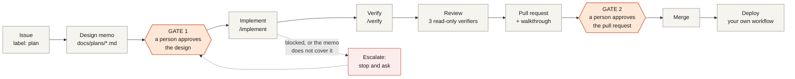
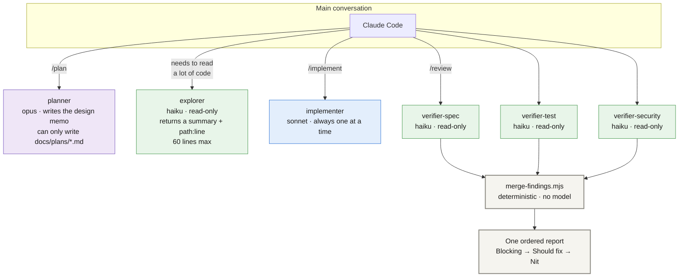
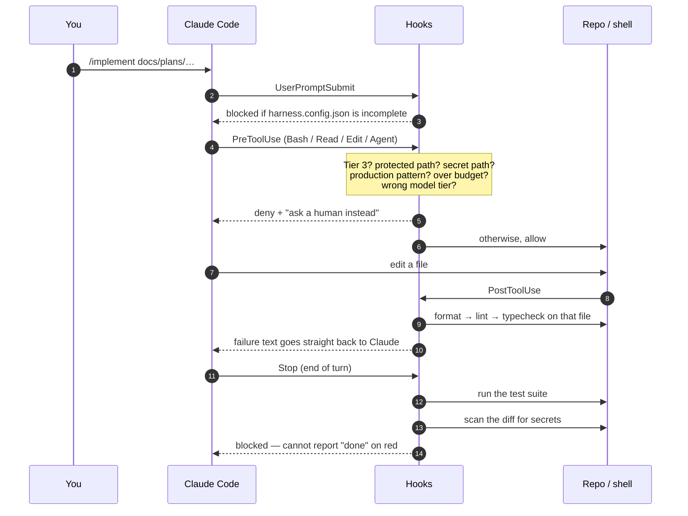
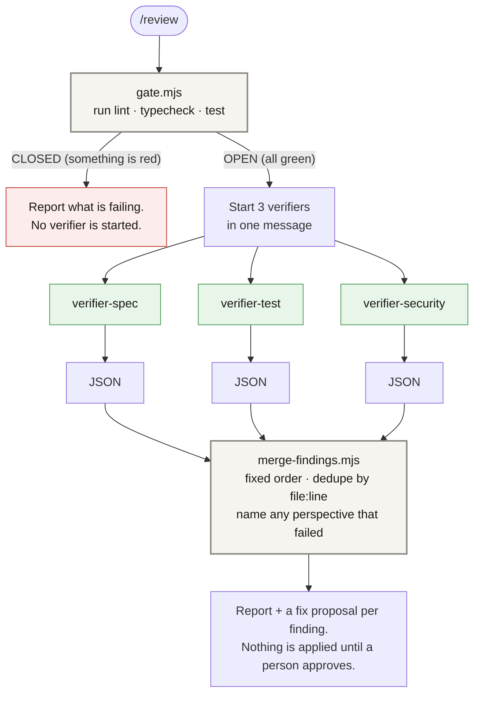
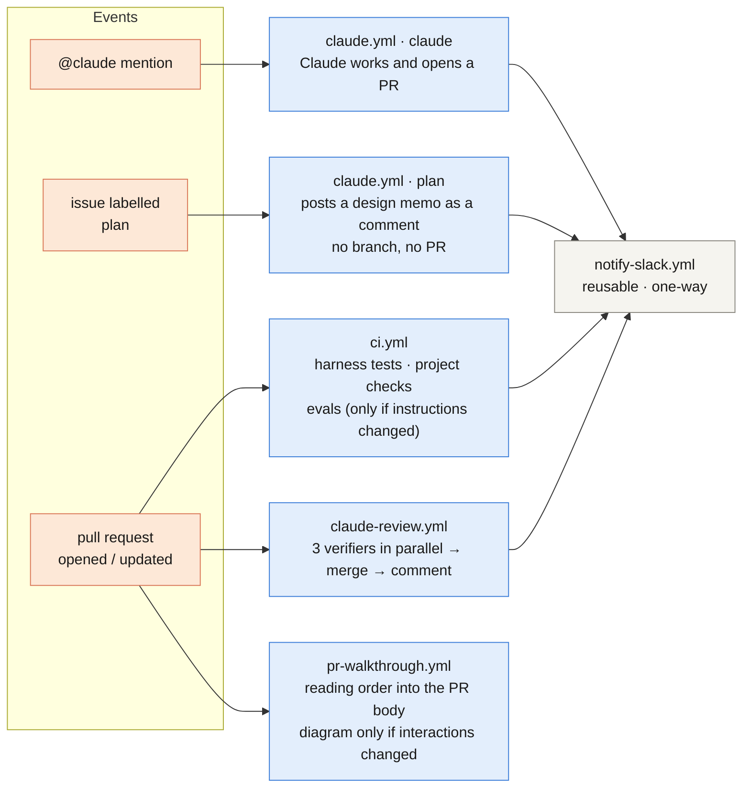
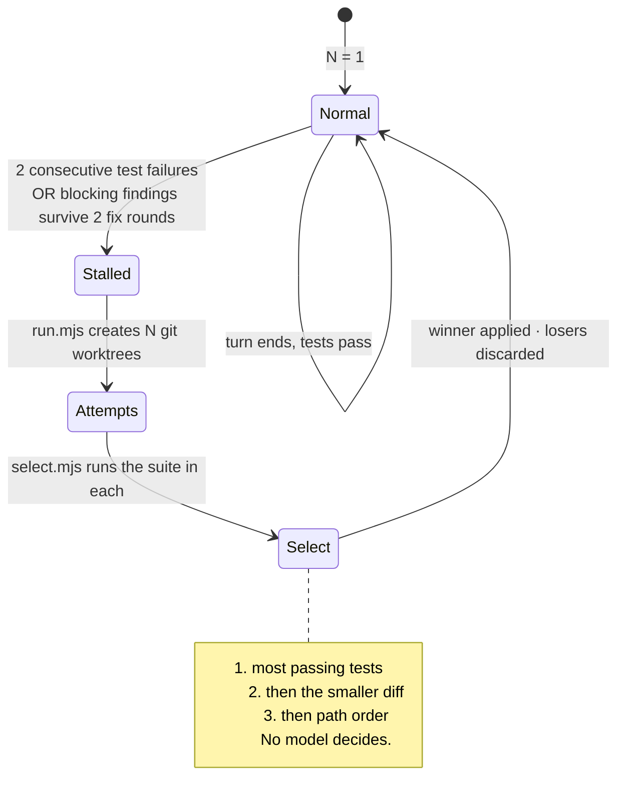
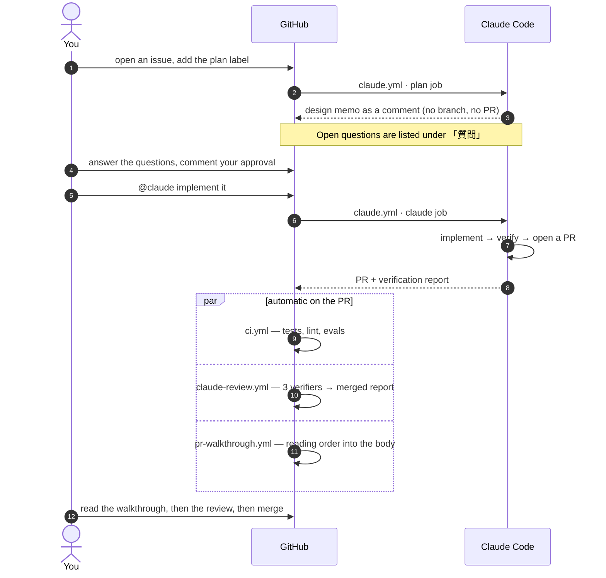

# How this repository works, and how to use it

*日本語版: [GUIDE.ja.md](GUIDE.ja.md)*

This is a **template repository**. Creating a repository from it gives you a two-branch
workflow, issue and PR templates, and an **agent operating harness**: a set of rules,
scripts and GitHub Actions that let Claude Code do real work on the repository without
anyone having to watch it continuously.

This guide explains what the pieces are, how they fit together, and what you do as a
person. The reference documents are [`POLICY.md`](POLICY.md) (the rules) and
[`../../CLAUDE.md`](../../CLAUDE.md) (what the agent reads every session); this page is
the map that ties them together.

**Read this first if you are:** picking up a repository built from this template, or
deciding whether to use it for a new project.

---

## 1. The idea in one picture

Work flows from an issue to a deployment. A person makes exactly **two** decisions on the
way — approve the design, approve the pull request. Everything between those two points
runs without stopping, because the checks that would otherwise need a human eye are
enforced by scripts instead.



**Why only two gates.** Approving every step turns approval into a reflex — people click
"yes" without reading, and the wait time is the only thing that grows. So the machine
checks (format, lint, types, tests, schema validity, secret scanning) are enforced by
hooks and CI, and human attention is spent on the two questions a machine cannot answer:
*is this the right thing to build?* and *did it actually get built?*

---

## 2. The agents

Roles are split so that reading and checking happen in cheap, isolated contexts, and only
their conclusions come back. This is not about having many agents — it is about keeping
the expensive context small and the checks independent.



| Agent | Tier | Why that tier | Tools |
| --- | --- | --- | --- |
| `planner` | **opus** (top) | Design decisions drive everything downstream, and it runs once or twice per task | read + write, but a hook confines writes to `docs/plans/*.md` |
| `implementer` | **sonnet** (mid) | The bulk of the output. The cheapest tier misreads design intent | read + write |
| `explorer` | **haiku** (cheapest) | Reads and summarises. Called most often, least judgement required | read-only |
| `verifier-spec` / `-test` / `-security` | **haiku** (cheapest) | Fixed perspective, fixed output shape, three running in parallel | read-only |

**The tier lives in exactly one place.** `.claude/harness.config.json` → `agents.*.model`.
The agent definition files deliberately do **not** contain a `model:` line. The caller
resolves the tier with `scripts/agents/model-for.mjs` and passes it as the `Agent` tool's
`model` parameter, and a hook rejects any call whose model does not match. That is what
stops a run from quietly promoting itself to a more expensive model.

### Why review is split three ways

Asking one reviewer to cover design, tests and security at once makes one of them thin.
Three reviewers each see only the design memo and the diff — never the conversation that
produced the code — and each looks at one thing:

- **`verifier-spec`** — does the diff match the design memo? Anything out of scope? Anything missing?
- **`verifier-test`** — do the tests merely mirror the implementation? Edge cases? Is the "not verified" list honest?
- **`verifier-security`** — input validation, secrets, permissions, new dependencies, treating external text as instructions

Their findings are merged by a **script**, not a model: fixed order, same file+line
collapsed into one entry, and any perspective that returned nothing is named as
*not verified*. A model doing the merging would summarise differently every run, and two
reviews would stop being comparable.

---

## 3. What the machine enforces

Hooks sit on the boundary of every tool call. They are the reason the middle of the
pipeline can run unattended.



| When | What is checked | On failure |
| --- | --- | --- |
| Prompt submitted | `/plan`, `/implement`, `/review` need a complete config | Stops and asks you to fill it in |
| Before a tool runs | Tier 3 commands, protected paths, secret paths, production patterns, parallel/nesting budget, model tier | Denied, with the reason and "ask a human" |
| After a file edit | `format` → `lint` → `typecheck` on that file | The failure text is returned to Claude, which fixes it before continuing |
| End of turn | Test suite, plus a secret scan of the diff | The turn cannot end |
| Explorer finishes | Output ≤ 60 lines, no pasted file bodies | Sent back to summarise again |

Blocks are appended to `.harness/blocked.jsonl`. The workflows read that file after a
Claude step and forward it to Slack — the hooks never talk to Slack themselves, so every
outbound message goes through GitHub Actions and stays auditable.

### Permission tiers

The dividing line is **reversibility and outside effects**.

| Tier | Treatment | Examples |
| --- | --- | --- |
| **1** | automatic | read files, edit inside the repo, run format/lint/typecheck/test, `git add/commit/branch/diff/log` |
| **2** | automatic | install dependencies, build, run locally, fetch from npm/PyPI/GitHub |
| **ask** | asks you | `git push`, `gh pr create/merge`, `git reset --hard`, `git rebase` |
| **3** | refused | force push, `rm -rf`, `sudo`, `curl`/`wget`, deploy commands, `npm publish`, editing `.github/workflows/**` `.claude/**` `.mcp.json`, reading `.env*` or key files, touching production |

Tier 3 is refused with an explanation and a pointer to the approvers — never a silent
failure.

---

## 4. `/review` end to end



Reviewers are expensive and their findings are noise while lint is still failing — so the
gate comes first, and it is a plain script. The same three-verifier structure runs in CI
as three parallel jobs, so one perspective failing shows up as a failed job while the
other two still report.

---

## 5. What runs in GitHub Actions



**Slack is notification-only.** Approving and answering happen on GitHub, so the audit
trail stays in one place. Claude Code has no Slack tool at all; the workflows send the
messages. Every message is at most 10 lines, puts bad news first, and never contains a
diff, a full log, or anything shaped like a secret. Events: `plan.ready`, `escalation`,
`pr.opened`, `verify.report`, `blocked`, `ci.failed`, `eval.failed`, `deploy.done`.

### The pull request walkthrough

Every pull request gets a reading order written into the top of its body, between
`<!-- harness:walkthrough:start -->` markers, so re-runs replace it and anything you wrote
by hand survives. The order is fixed — **schema → types → logic → callers → UI → tests →
config → docs** — so prerequisites come first and you never have to scroll back.

A sequence diagram is added **only** when the diff changes how parts talk to each other:
external API calls, events, async jobs, or auth flows. That decision is made by static
patterns, not by a model. When a diagram is produced it always carries an
**auto-generated · needs checking** label, and `verifier-spec` treats a mismatch between
the diagram and the diff as a *Should fix*.

---

## 6. Best-of-N: only when things are stuck



Running N attempts costs N times as much, and when things are going well the extra
attempts buy nothing. So **there is no setting that turns this on permanently** — it arms
itself only after two consecutive test failures, or blocking findings surviving two rounds
of fixes. Losing attempts are deleted; a one-line summary of why each failed stays in the
verification report.

---

## 7. Using this repository

### 7.1 First-time setup for a new project

```bash
# 1. Create your repository from the template on GitHub ("Use this template")

# 2. Fill in the facts that differ per project
cp .claude/harness.config.example.json .claude/harness.config.json
$EDITOR .claude/harness.config.json   # approvers, deploy, commands — see the table below

# 3. Register the secret (organisation secrets do not reach private repos on the Free plan)
claude setup-token                    # prints a token
bash scripts/bootstrap-secrets.sh     # asks for it, stores it on this repository

# 4. Check the harness runs
bash tests/harness/run.sh

# 5. Commit the config, and set branch protection on main and development
```

`.claude/harness.config.json` is the **only** place project-specific facts live. Settings,
hooks, CI and the slash commands all read it, so there is nothing to keep in sync.

| Key | What it is | Required |
| --- | --- | --- |
| `approvers` | GitHub handles who approve design memos and PRs | ✅ at least one |
| `deploy.target` / `productionBranch` | where production is, and which branch releases | ✅ |
| `deploy.productionPatterns` | regexes that identify production hosts/env names — any command matching one is blocked | — |
| `commands.{format,lint,typecheck,test}` | your project's own commands. `{file}` is substituted with the edited file when present; empty means "not configured" and the step is skipped with a note | ✅ `test` |
| `agents.*.model` | model tier per role | ✅ all four |
| `budget` | `maxTurns` 30 · `maxMinutes` 30 · `maxParallel` 4 · `maxDepth` 1 · `bestOfN` 3 | ✅ |
| `protectedPaths` | readable, but the agent may not write them | ✅ must include `.mcp.json` |
| `secretPaths` | the agent may neither read nor write them | ✅ |
| `slack` | channel id, approver Slack ids, per-event on/off. Empty channel disables notifications entirely | ✅ (may be empty) |

> **Note.** The template ships **no** `harness.config.json` — only the example. Until you
> create one, `/plan`, `/implement` and `/review` refuse to run and tell you what is
> missing. That is deliberate: an agent that does not know who approves things should not
> be starting work.

### 7.2 The day-to-day loop



**Locally** the same flow is `/plan` → approve → `/implement` → `/verify` → `/review`.
`/absorb` takes a review comment or a correction you made and proposes where it should
live permanently — an eval case, a line in `CLAUDE.md`, or a new hook rule.

### 7.3 When the agent stops and asks

It is supposed to stop. The conditions are in [`CLAUDE.md`](../../CLAUDE.md) §3: the
instruction contradicts the code or the memo, an outside side effect is needed, the change
falls outside the design memo, tests cannot run for environmental reasons, a hook blocked
something, or an MCP server would be needed.

Answer **on GitHub**, not in Slack — then run `/absorb <your answer>` so the same question
does not come back a third time.

### 7.4 Stopping things

| Goal | Action |
| --- | --- |
| Stop a running job | Actions → the run → **Cancel workflow** |
| Stop future runs | Actions → `Claude Code` / `Claude Review` → **Disable workflow** |
| Tighten the budget urgently | Repository variables `HARNESS_MAX_TURNS` / `HARNESS_MAX_MINUTES` (these beat the config; `HARNESS_MAX_TURNS=1` is effectively a stop) |
| Cut off access entirely | Delete or rotate the `CLAUDE_CODE_OAUTH_TOKEN` secret |
| Silence Slack | Set `slack.channel` to `""`, or flip individual `slack.events.*` to `false` |
| Lower the cost | Change `agents.*.model`. Nothing else pins a model, so this one edit reaches every path |

### 7.5 Where to look when you want to know what happened

| Question | Where |
| --- | --- |
| What did the agent actually do? | Actions → the run → the Claude step log |
| What did a hook block, and why? | The same log, lines starting with `[harness]`; locally `claude --debug hooks` |
| What did the reviewers say? | The PR comment titled *Independent review* |
| Why did an eval pass or fail? | CI artifact `eval-results` → `judge-log.jsonl` (each verdict with its reason) |
| Which design memo was this? | `docs/plans/*.md`, linked from the walkthrough at the top of the PR |

---

## 8. Adapting it to your project

**The quality bar does not change between customer projects and internal ones.** The only
things that differ are the facts in `harness.config.json`. There are no profiles, modes or
customer/internal switches anywhere — and CI fails if someone adds one.

Things you will legitimately want to change:

- **`commands.*`** — your stack's real commands. The template's defaults are Python (`ruff`, `pytest`)
- **`deploy.productionPatterns`** — the host names and environment names that mean production for you
- **`protectedPaths` / `secretPaths`** — anything else the agent must not write, or must not read
- **`evals/cases/`** — add a golden case whenever you can phrase an expectation as "given this input, behave like this"
- **Deploy** — the template ships none. Add your own workflow; to get the Slack notice, call the reusable workflow at the end:

  ```yaml
  notify:
    needs: deploy
    permissions: { contents: read, issues: write }
    uses: ./.github/workflows/notify-slack.yml
    secrets: inherit
    with:
      event: deploy.done
      payload: '{"repo":"${{ github.repository }}","target":"…","deployUrl":"https://…"}'
  ```

Things you should **not** change without reading [`POLICY.md`](POLICY.md) §10 first: the
tier table, where the two gates sit, and the rule that merging, ranking, grouping and the
diagram trigger are all decided by scripts rather than by a model. Those three properties
are what make the output comparable from one run to the next.

---

## 9. Reference

| Document | What it covers |
| --- | --- |
| [`POLICY.md`](POLICY.md) | The operating rules: tiers, gates, escalation, sampling review, kill switch, audit trail, OpenTelemetry |
| [`../../CLAUDE.md`](../../CLAUDE.md) | What the agent reads every session: workflow, escalation conditions, report format, prohibitions |
| [`MCP_CATALOG.md`](MCP_CATALOG.md) | Approved MCP servers and the security review a new one must pass |
| [`EXTERNAL_REVIEW.md`](EXTERNAL_REVIEW.md) | Optional external review tools, and how their role differs from the harness verifiers |
| [`../../README.md`](../../README.md) | Branching model and Claude Code in GitHub Actions |
| `tests/harness/run.sh` | Everything above, as executable tests |
