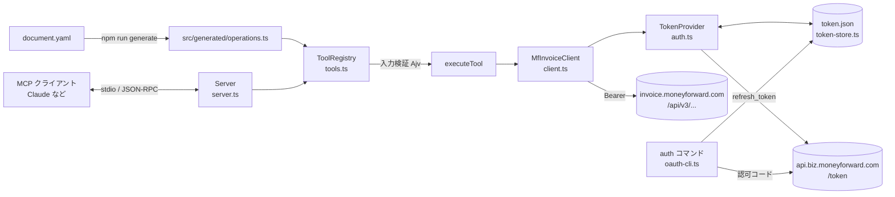

# 内部構成

## 全体像

## モジュール

| ファイル                         | 役割                                                                                                                                              |
| -------------------------------- | ------------------------------------------------------------------------------------------------------------------------------------------------- |
| `src/index.ts`                   | エントリポイント。引数なしで stdio サーバー、`auth` で認可コマンド、`--version` / `--help`。ログは標準エラー出力へ                                |
| `src/server.ts`                  | MCP `Server` を組み立て、`tools/list` と `tools/call` を登録                                                                                      |
| `src/config.ts`                  | 環境変数の読み込みと検証                                                                                                                          |
| `src/auth.ts`                    | トークン提供。`RefreshTokenProvider`（取得・キャッシュ・ローテーション保存）、`StaticTokenProvider`、`MissingCredentialsProvider`、`requestToken` |
| `src/token-store.ts`             | トークンファイルの読み書き（一時ファイル → 置き換え、権限 0600）                                                                                  |
| `src/oauth-cli.ts`               | `auth` コマンド。ローカルで待ち受けて認可コードを受け取り、トークンに交換して保存                                                                 |
| `src/client.ts`                  | HTTP クライアント。リクエスト組み立て、エラー（`MfApiError`）変換、401 時の再試行                                                                 |
| `src/tools.ts`                   | 操作定義 → MCP ツール定義、Ajv による入力検証、実行と結果の整形、公開範囲（読み取り専用・除外）                                                   |
| `src/openapi/convert.ts`         | OpenAPI → 操作定義・JSON Schema 変換（生成スクリプトとテストで共用）                                                                              |
| `src/version.ts`                 | サーバー名と、`package.json` から読むバージョン                                                                                                   |
| `src/generated/operations.ts`    | 生成物（直接編集しない）                                                                                                                          |
| `scripts/generate-operations.ts` | 生成スクリプト（`npm run generate`）。`docs/tools.md` も出力                                                                                      |

## 設計上の判断

### ツール定義は仕様書から生成する

45 操作を手で書くと、仕様書の更新に追従できなくなります。`document.yaml` を正とし、生成物をコミットしたうえで
「生成物が仕様書と一致しているか」をユニットテストで検査しています。

### 仕様書の `x-mcp` 拡張を使う

`document.yaml` には操作ごとに `x-mcp`（`operationKind`、`description`、`useWhen`、`doNotUseWhen`）が、パラメータごとに
`x-mcp.description` が付いています。ツールの説明・引数の説明・注記はこれを元に作ります。説明文中の operationId
（例: `get-partners`）はツール名（`get_partners`）に置き換え、LLM がそのまま次のツールを呼べるようにしています。

### Ruby 形式の正規表現を変換する

仕様書の `pattern` には Ruby 形式が混在しています（`'/^T\d{13}$/'`、`/\A…\z/`、所有量指定子 `*+`）。
JSON Schema の `pattern` は ECMAScript の正規表現なので、区切りの除去・`\A`→`^`・`\z`→`$`・所有量指定子の除去を行い、
それでも解釈できないものは `pattern` を外します（API 側の検証に任せる）。

### 低レベル API の `Server` を使う

MCP SDK の `McpServer.registerTool` は Zod スキーマを前提にしています。このサーバーは OpenAPI から変換した
JSON Schema をそのまま `inputSchema` として公開したいので、`Server` に `ListTools` / `CallTool` のハンドラーを直接登録しています。

### ツール引数の形

- パス／クエリパラメータはトップレベルの引数（例: `partner_id`, `page`）
- リクエストボディは `body` 引数（仕様書のスキーマそのまま）。必須項目を持つボディは `body` 自体を必須にする
- 未定義の引数は受け付けない（`additionalProperties: false`）

### 注記（annotations）は operationKind から決める

| operationKind | readOnlyHint | destructiveHint | idempotentHint |
| ------------- | ------------ | --------------- | -------------- |
| read          | true         | false           | true           |
| create        | false        | false           | false          |
| update        | false        | true            | true           |
| delete        | false        | true            | true           |

仕様書に `402 Payment Required` がある操作（郵送依頼）は、説明に料金が発生しうる旨を付けます。

### リフレッシュトークンを保存する

リフレッシュトークンは更新のたびに新しい値が返る場合があります（ローテーション）。古い値が無効になる実装だと、
環境変数に書いた値だけではサーバーの再起動後に認証できなくなるため、最新の値をトークンファイルに保存します。
起動時はファイルの値を優先し、`invalid_grant` で拒否されたら環境変数の値で 1 回だけやり直します。
有効なアクセストークンもファイルに残すので、再起動のたびにトークンを取り直すことはありません。

### エラーはツール結果として返す

API エラー・入力検証エラー・設定不足は、JSON-RPC のエラーではなく `isError: true` のツール結果として返します。
LLM が内容を読んで、引数の修正や利用者への確認ができるようにするためです。ステータスごとに対処のヒント
（401: 再認可、402: 料金、403: 必要なスコープ、404: ID の確認、429: Retry-After）を添えます。

## 仕様書を更新するとき

1. `document.yaml` を差し替える
2. `npm run generate`
3. `npm run check`
4. 差分（`src/generated/operations.ts`, `docs/tools.md`）を確認してコミット
