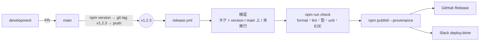

# リリース（npm への発行）

`main` のコミットにリリースタグ（`v1.2.3` など）を push すると、`.github/workflows/release.yml` が npm にパッケージを発行します。
手元で `npm publish` は実行しません。



## 発行ワークフローの動作

| ステップ              | 内容                                                                                                   |
| --------------------- | ------------------------------------------------------------------------------------------------------ |
| トリガー              | タグ `v*.*.*` の push（GitHub の画面でタグ付きの Release を作った場合も同じ）                          |
| タグと version の一致 | タグ `vX.Y.Z` と `package.json` の `version` が違えば失敗                                              |
| main 上のコミットか   | タグのコミットが `main` に含まれていなければ失敗（`development` や作業ブランチから誤って発行しない）   |
| 未発行か              | 同じ版が npm にあれば失敗                                                                              |
| 検証                  | `npm ci` → `npm run check`（format / lint / typecheck / ユニット / E2E）。外部 API には接続しない      |
| 同梱物の確認          | `npm pack --dry-run` の結果をログに出す（`dist/` と `README.md`、`package.json` だけ）                 |
| 発行                  | `npm publish --provenance --access public`。版に `-` を含む（`1.2.0-rc.1` など）ときは dist-tag `next` |
| GitHub Release        | 無ければ作成（リリースノートは自動生成。プレリリース版はプレリリース扱い）                             |
| 通知                  | テンプレートの `notify-slack.yml` で `deploy.done` を送る（失敗してもワークフローは失敗しない）        |

発行ジョブは GitHub の Environment `npm` で動きます。Settings → Environments → `npm` に承認者を設定すると、発行の直前に人の承認を挟めます。

## 初回だけ行うこと

1. **ワークフローを配置する**。`.github/workflows/` は Claude Code から編集できない保護パスのため、案を手でコピーしてコミットします。

   ```bash
   cp docs/release/release.yml .github/workflows/release.yml
   ```

2. **npm の組織を用意する**。パッケージ名 `@toolchainjp/mf-invoice-mcp-server` は npm 組織 `toolchainjp` が必要です。
   別の名前にする場合は `package.json` の `name` を変えます（`src/version.ts` やメッセージは `package.json` から読みます）。
3. **`package.json` の `repository.url` を実際の GitHub リポジトリに合わせる**。provenance（来歴証明）はこの URL と
   ワークフローを実行したリポジトリが一致しないと失敗します。
4. **npm の認証を設定する**（どちらか）。
   - **Trusted Publishing（推奨）**: npmjs.com のパッケージ設定 → Trusted Publisher に GitHub Actions として
     リポジトリ、ワークフロー `release.yml`、Environment `npm` を登録します。シークレットは不要です。
     まだ一度も発行していないパッケージには設定できないため、最初の 1 回だけは下のトークン方式で発行します。
   - **トークン**: npmjs.com で Granular Access Token（対象パッケージへの Read and write）を作り、
     リポジトリシークレット `NPM_TOKEN` に登録します。

## リリース手順

1. `development` → `main` の PR を作ってマージします（`main` は常にリリース可能）。
2. `main` を最新にして、版を上げます。`npm version` は `package.json` / `package-lock.json` の更新、コミット、タグ作成をまとめて行います。

   ```bash
   git switch main && git pull
   ```

   ```bash
   docker compose run --rm dev npm version patch --no-git-tag-version
   ```

   Docker の中では git を使わないため、コミットとタグは手元で作ります。

   ```bash
   git commit -am "Release v0.1.1" && git tag v0.1.1
   ```

   ブランチ保護で `main` に直接 push できない場合は、版を上げる PR を `main` に出してマージしてから、マージ後のコミットにタグを付けます。

3. タグを push します。これで発行ワークフローが動きます。

   ```bash
   git push origin main v0.1.1
   ```

4. Actions の「Release」が成功したら、npm と GitHub Release を確認します。

版の付け方: 互換性のない変更（ツール名・引数の変更、環境変数の削除）は major、ツールの追加や機能追加は minor、修正は patch。
仕様書の更新でツール名や引数が変わる場合は major にします。

## うまくいかないとき

| エラー                                        | 対処                                                                            |
| --------------------------------------------- | ------------------------------------------------------------------------------- |
| タグと package.json の version が一致しません | `package.json` の版を上げたコミットにタグを付け直します                         |
| タグのコミットが main に含まれていません      | `main` にマージしてから、`main` のコミットにタグを付けます                      |
| 既に npm に発行されています                   | npm は同じ版を再発行できません。版を上げて新しいタグを作ります                  |
| `npm publish` が 404 / 403                    | npm 組織の権限、Trusted Publisher の登録内容、`NPM_TOKEN` を確認します          |
| provenance のエラー                           | `package.json` の `repository.url` が実際のリポジトリと一致しているか確認します |

失敗したタグを消して付け直すときは、`git push --delete origin v0.1.1` の後にタグを作り直します（発行前に失敗した場合だけ）。
